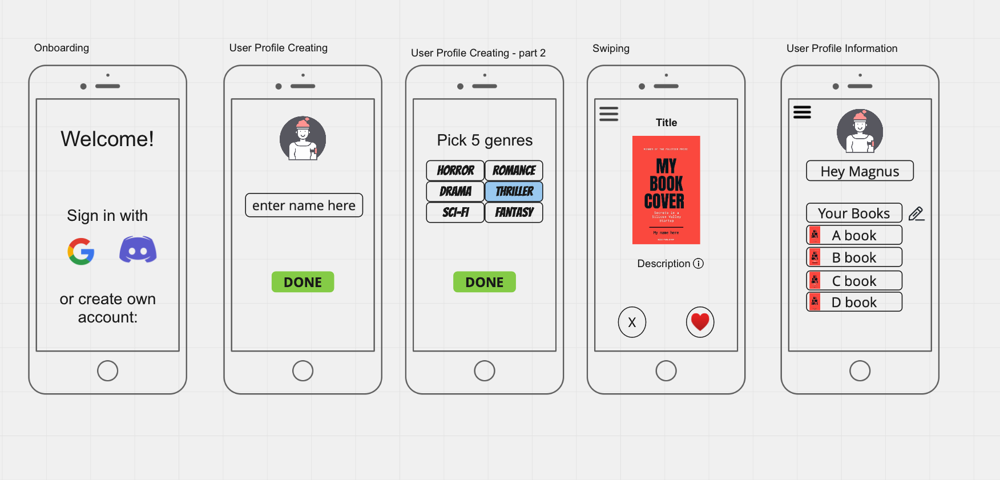

# Binder: Short description of our project

Tinder for books. You get suggestions of books and you swipe left or right in order to add the suggested book to your list.

Names and Canvas IDs

- Emil Lantz, 77314
- Mattias Arvidsson, 77973
- Elvira Dzidic, 77673 
- Simon Döbele, 121732

## Mockup

https://miro.com/app/board/uXjVOIKRW6w=/

## What we have done
Currently, we have built the (Binder)Model, connection from the model to firebase through an observer, implemented an API call for showing a first array of books, are able to save that API data to firebase. Plus, we built the following views (and associated presenters):

### Login View (called "Onboarding" in the mockup)
- The user can sign in with username and password credentials (which takes the user to his list of liked books).
- The user can choose to sign up, if the user has no account (which takes the user to the User Creation view).

### User Creation View
- The user can enter their username, e-mail and password (not connected to firebase, yet).
- After a first sign-up, the user is taken to the User Creation Genre View.

### User Creation Genre View
- The user is presented with different book genres (or subjects) that he is interested in.
- This view takes the user to the user (profile) info(rmation) view.

### User Info View
- Information about the user (picture, liked books) is presented to the user.

### Swipe View
- The user gets presented with books and gets the options to “like it” or “dislike it”.
- The liked books get added to the liked books list (that can be seen in user info view).

### API
- We are using the following API to get our data: https://openlibrary.org/dev/docs/api/books
- The data currently includes: book title, book cover. 

## What we still plan to do

### Login View (called "Onboarding" in the mockup)
- Enable user sign up through firebase.
- Enable user authentication through firebase.
- Enable user to login even when password was forgotten.

### User Creation View
- The user is able to sign up (with e-mail and password, through firebase).
- The user can add a profile picture.

### User Creation Genre View
- The user can pick out of the genres presented to him in order to get suitable book suggestions in binder.

### User Info View
- The user can delete books from the liked books list.
- (Possibly: The user can look at specific book details, i.e. a kind of details view will be needed).

### Swiping
- The interaction is fun for the user (actual swiping will be enabled for smartphone users and something similarly fun for PC users.)

### API
- The data might in the future include: book description, author(s), book genre / subject.
- If there is time, a second, machine-learning-based translation API could be included to enable non-English users to use the app.

## Our project file structure (with short description/purpose of each file)
.
├── public
│   └──  style.css          # our CSS style file
├── src                     
│   ├── apiConfig.js           # API configuration file (currently not used)       
│   ├── binderModel.js         # Our Model for the MVP architecture
│   ├── dishSource.js          # Functions for API calls
│   ├── firebaseConfig.js      # Firebase configuration file
│   ├── firebaseModel.js       # Observer functionality (updates from firebase to model & vice versa)
│   ├── index.html             # (Notifies, if you have Javascript disabled.)
│   ├── resolvePromise.js      # Resolves promises (just like in TW3)
│   ├── utilities.js           # will contain utility functions for the model (currently not used)
│   ├── views                  # THE VIEWS (mostly)
│   │   ├── app.js                     # Displays the different components
│   │   ├── loginView.js               # (see description of the views above - "What we have done")
│   │   ├── navigation.js              # helps navigate at startup (to login view)
│   │   ├── promiseNoData.js           # For user experience (when waiting for promise to be resolved)
│   │   ├── swipeView.js               # (see description of the views above - "What we have done")
│   │   ├── userCreationGenreView.js   # (see description of the views above - "What we have done")
│   │   ├── userCreationView.js        # (see description of the views above - "What we have done")
│   │   └── userInfoView.js            # (see description of the views above - "What we have done")
│   └── vuejs                  # THE PRESENTERS (mostly) 
│       ├── index.js                        # Renders the root & Resolves the initial persistence promise
│       ├── loginPresenter.js               # (Presenter corresponding to the View with same name (MVP architecture))
│       ├── show.js                         # utility for deciding the change to a different view
│       ├── swipeView.js                    # (Presenter corresponding to the View with same name (MVP architecture))
│       ├── userCreationGenrePresenter.js   # (Presenter corresponding to the View with same name (MVP architecture))
│       ├── userCreationPresenter.js        # (Presenter corresponding to the View with same name (MVP architecture))
│       ├── userInfoPresenter.js            # (Presenter corresponding to the View with same name (MVP architecture))
│       ├── VueRoot.js                      # The Vue Root that ties the bindermodel and app together.
│       └── ...                             # (Please ignore the other files, that are still boilerplate code.)
└── ...
